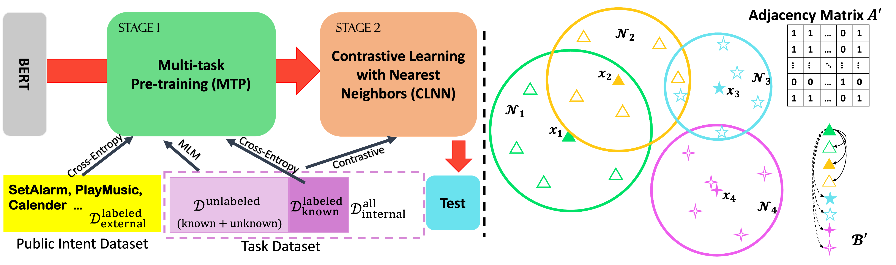

# New Intent Discovery with Pre-training and Contrastive Learning (ACL main 2022, long paper)

This the official PyTorch implementation of paper [MTP-CLNN](https://aclanthology.org/2022.acl-long.21/), please check the paper for more details. New intent discovery aims to uncover novel intent categories from user utterances to expand the set of supported intent classes. It
is a critical task for the development and service expansion of a practical dialogue system. Our method provide new solutions to two important research questions for new intent discovery: (1) how to learn semantic utterance representations and (2) how to better cluster utterances. Particularly, we first propose a multi-task pre-training (MTP) strategy to leverage rich unlabeled data along with
external labeled data for representation learning. Then, we design a new contrastive loss to exploit self-supervisory signals in unlabeled data for clustering.



## Data
We have already included the data folder in our code.

## Requirements
This is the environment we have testified to be working. However, other versions might be working too.

* python==3.8
* pytorch==1.10.0
* transformers==4.15.0
* faiss-gpu==1.7.2
* numpy
* pandas
* scikit-learn

## Download External Pretrained Models
The external pretraining is conducted with [IntentBert](https://github.com/fanolabs/IntentBert).
You can also download the pretrained checkpoints from following [link](https://drive.google.com/drive/folders/1k4kI5EYEBibId3cEydcjgLOwb5Y4noCT?usp=sharing). And then put them into a folder ``pretrained_models`` in root directory. The link includes following models.

* IntentBert-banking
* IntentBert-mcid
* IntentBert-stackoverflow

## File Structure
Please organize the file structure like following:
```
MTP-CLNN
├── README.md  (this file)
├── data (each folder is a dataset)
    ├── banking
    ├── mcid
    ├── stackoverflow
    └── clinc
├── pretrained_models (external pretrained models)
    ├── banking
    ├── mcid
    └── stackoverflow
├── saved_models (save trained clnn models)
├── scripts (running scripts with hyper-parameters)
├── utils
    ├── contrastive.py (objective function)
    ├── memory.py (memory bank for loading neighbors)
    ├── neighbor_dataset.py
    └── tools.py
├── clnn.py
├── mtp.py
├── init_parameters.py (hyper-parameters)
├── model.py
└── dataloader.py
```

## Run
Run MTP-CLNN on any dataset as following
```
bash scripts/clnn_${DATASET_NAME}.sh ${GPU_ID}
```
and please fill in the ``${DATASET_NAME}`` with dataset name and ${GPU_ID} with GPU_ID you want to run on.

## Citation
```
@inproceedings{zhang-etal-2022-new,
    title = "New Intent Discovery with Pre-training and Contrastive Learning",
    author = "Zhang, Yuwei  and
      Zhang, Haode  and
      Zhan, Li-Ming  and
      Wu, Xiao-Ming  and
      Lam, Albert",
    booktitle = "Proceedings of the 60th Annual Meeting of the Association for Computational Linguistics (Volume 1: Long Papers)",
    month = may,
    year = "2022",
    address = "Dublin, Ireland",
    publisher = "Association for Computational Linguistics",
    url = "https://aclanthology.org/2022.acl-long.21",
    pages = "256--269"
}
```

## Thanks
Some of the code was adapted from:
* https://github.com/thuiar/DeepAligned-Clustering
* https://github.com/wvangansbeke/Unsupervised-Classification
* https://github.com/HobbitLong/SupContrast

## Contact
Yuwei Zhang zhangyuwei.work@gmail.com